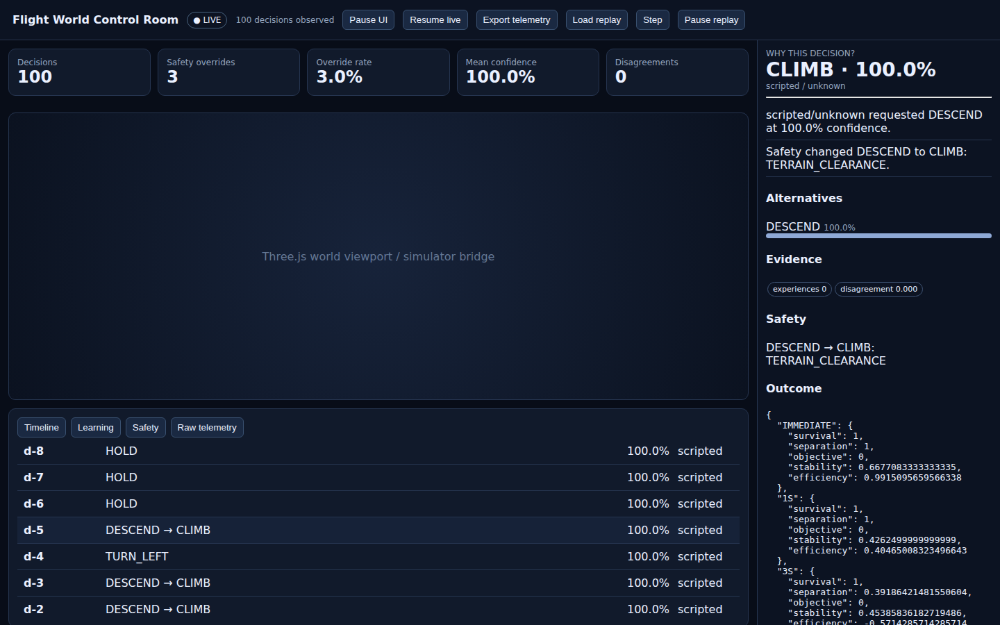
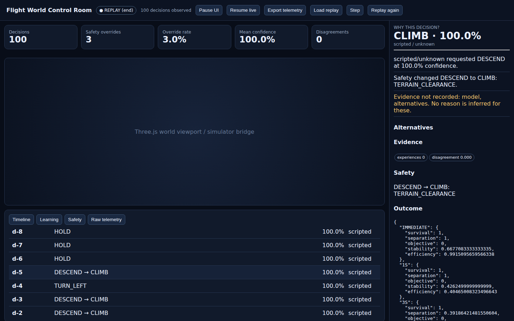
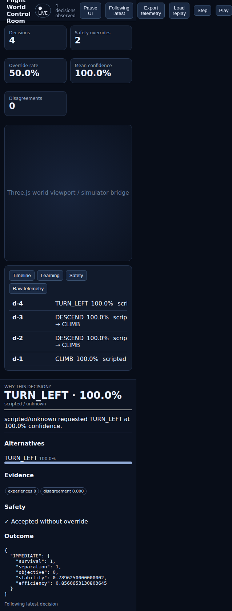
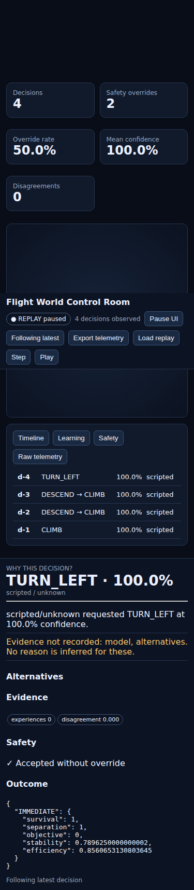
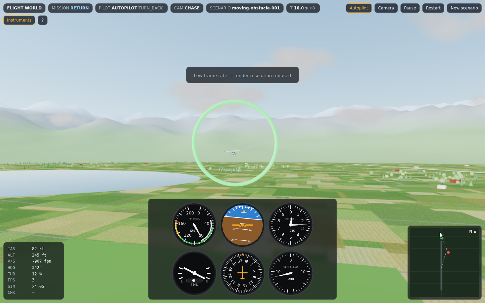
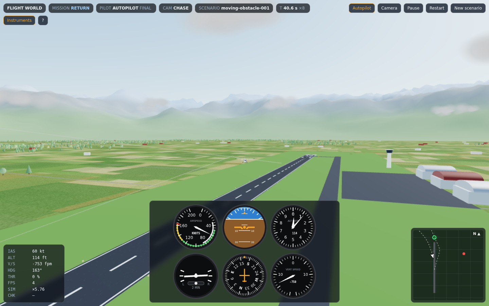
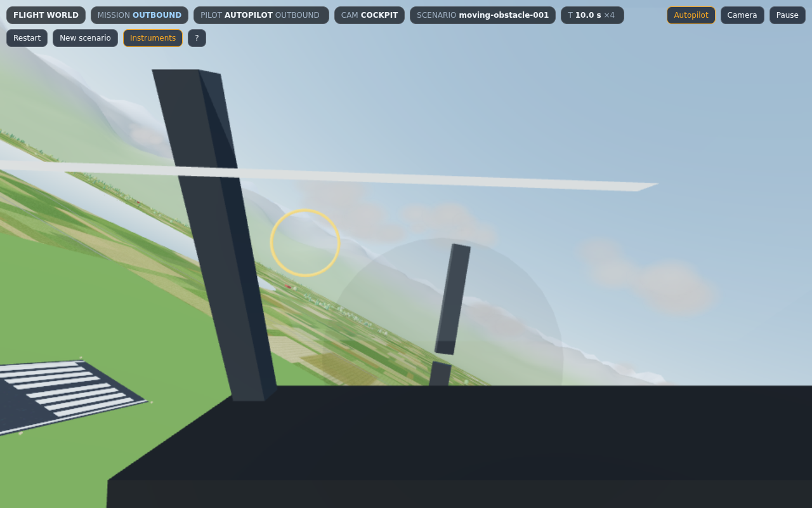
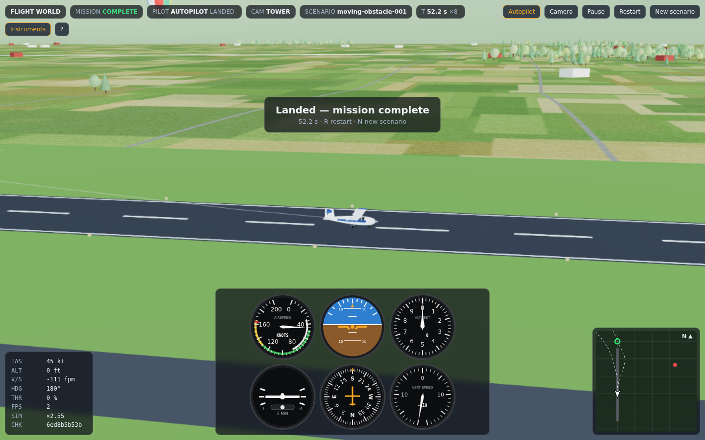
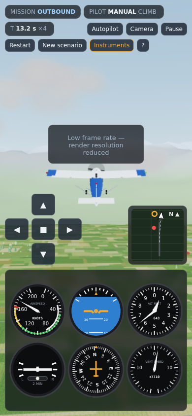

# QA Report: Flight World R25 — Replay & Watchdog

| Field | Value |
|-------|-------|
| **Date** | 2026-09-25 |
| **URL** | Control Room `http://localhost:3100/` (apps/inspector) · 3D simulator `http://localhost:3200/` (apps/simulator), both served by `bun <app>/index.html` |
| **Branch** | `claude/flight-world-r25-replay-watchdog-h2atwj` |
| **Commit** | baseline `bfcc2c8` (R25 as delivered) → final HEAD of branch |
| **Tier** | Standard (critical + high + medium fixed; low fixed where trivial) |
| **Scope** | Full app: build, typecheck, unit tests, repo checkers, CLIs, real XGBoost WASM, simulator worker, Control Room replay/watchdog/explainability in Chromium |
| **Method** | gstack `/qa` (github.com/garrytan/gstack `qa/SKILL.md`). The Aside browser isn't available in this container, so the browser steps ran through Playwright + headless Chromium (`scripts/browser-qa.mjs`). |
| **Toolchain** | Bun 1.3.11, TypeScript 7.0.2 (what `typescript@latest` resolves to), zod 4.6.5, @wlearn/xgboost 0.2.0, three 0.180.0 |
| **Pages visited** | 2 apps; Control Room at 1440×900 and 375×812; cross-origin iframe host |
| **Screenshots** | 14 (`screenshots/before-*`, `screenshots/after-*`) |
| **Framework** | Vanilla TS SPA (Bun HTML bundler) + Three.js |

## Health Score: 70 → 90 (provisional)

Scored with the gstack rubric. **Links** is not scored because the app has no anchors. **Accessibility** is not scored because no audit was run. Scores are over the remaining 75% of the weight.

| Category | Baseline | Final | Notes |
|----------|---------:|------:|-------|
| Console | 100 | 100 | 0 console errors / uncaught exceptions in either app, before or after |
| Visual | 92 | 100 | ISSUE-020 |
| Functional | 0 | 61 | Baseline: 2 critical and 7 high. Final: 1 high and 3 medium are deferred (below) |
| UX | 89 | 100 | ISSUE-019, ISSUE-022 |
| Performance | 100 | 100 | Control Room load ≈ 530 ms; 100-decision replay plays smoothly |
| Content | 100 | 100 | |

## Headline: what "PASS" did not cover

Both R25 checkers passed (0 errors) at baseline, but the real toolchain did not:

| Check | R25 as delivered | After QA |
|---|---|---|
| `python3 scripts/static-check.py` | PASS (but scans node_modules once installed: 986 files) | PASS, 149 files |
| `python3 scripts/api-audit.py` | **FAIL** after `bun install` (node_modules false positives) | PASS |
| `bunx tsc --noEmit` | **FAIL**: tsconfig rejected by TS 7, then **18 type errors** | **0 errors** |
| `bun test` | **5 fail / 56**, 2 files can't load; with the load errors fixed, `r11` **hangs and grows past 4 GB RAM** | **69 pass / 0 fail** |
| `bun run audit` | passes, but walks 1,943 files in node_modules | PASS, 149 files |
| `bun run audit:deps` | **crashes** (ENOENT packages/aircraft), so CI would be red | PASS |
| `scripts/release-check.sh` / `bun run verify:all` | **FAIL** | **PASS** |
| Real XGBoost WASM | never executed | **trains, predicts, saves/loads**: 400 rows in ≈ 0.4 s, 99.7% on a separable task, model round-trips across workers with identical predictions |

## Top 3 Things to Fix (at the time of the QA pass — all resolved since, see "Follow-up" below)

1. **DEFERRED-A (high): the XGBoost "best practice" learner is trained on the wrong target.** `trainingWeight` up-weights catastrophic and overridden rows, but the label is the *executed action*. Upweighting would teach the model to recommend exactly the actions that failed. Right now the weights are silently dropped anyway: `@wlearn/xgboost`'s `fit(X, y)` ignores a third argument. Proof: a 10 CLIMB-success vs 10 DESCEND-catastrophe set gives 50/50 (`scripts/xgb-persist-weights.ts`), where the weights (≈4 vs 12) should give roughly 25/75. Either train only on successful/non-overridden outcomes, or model outcome quality per action (e.g. predict success given situation+action), then pass weights through `DMatrix.setWeight`. This is a design decision, so it wasn't changed here.
2. **DEFERRED-B (medium): the real runtime records almost none of the "Why?" evidence.** `ObservableFlightRuntime` emits a canonical `DecisionFrame` with only id/intents/provider/probability. It has no model, alternatives, temporal patterns, ExperienceForest ids, XGBoost recommendation, Dreamer assessment or provider disagreement. In a real replay the Why panel therefore shows provider + safety + outcome only, and now says so ("Evidence not recorded: model, alternatives"). The `frame.trace` path the dashboard supports is never produced by the runtime.
3. **DEFERRED-C (medium): the benchmark baseline fails 100% and doesn't vary.** `apps/benchmark` reports 0/100 complete. The autopilot starts its descent from 85 m at 90 m/s within 120 m of the runway and hits the ground at ≈ 29 m/s sink (`scripts/bench-diag.ts`). `defaultScenario(seed)` ignores the seed for geometry, so all 100 "scenarios" are the same flight.

Also deferred:
- **DEFERRED-D (medium):** the 3D simulator page (`apps/simulator/src/main.ts`) renders a static cone and grid. It never creates `SimulationWorkerClient` or `WorldView`, so nothing flies. The worker itself works after ISSUE-009.
- **Not scored:** accessibility (buttons have text labels; no keyboard/contrast audit done).

## Console Health

| Error | Count | First seen |
|-------|-------|------------|
| (none) | 0 | — |

## Summary

| Severity | Found | Fixed | Deferred |
|----------|------:|------:|---------:|
| Critical | 2 | 2 | 0 |
| High | 8 | 7 | 1 |
| Medium | 16 | 13 | 3 |
| Low | 2 | 2 | 0 |
| **Total** | **28** | **24** | **4** |

## Issues and fixes

| Issue | Sev | Category | What was wrong | Fix status | Commit |
|---|---|---|---|---|---|
| ISSUE-014 | **critical** | functional | `CognitivePilot` took `candidates[0]` as the decision. Providers return candidates in request order, so **the aircraft always flew HOLD at 0% whatever Jev/Open-Jev/scripted recommended**, and safety never had anything to override. `compareResponses` had the same bug, so provider disagreement always said "same top choice". Added `topCandidate()`. | verified | `234be87` |
| ISSUE-015 | **critical** | functional/security | Timeline, alerts, watchdog, evidence and alternatives were rendered with `innerHTML` from telemetry, so a crafted replay JSONL ran script (`window.__xss` set). Now built with `textContent`. | verified | `549fde5` |
| ISSUE-002 | high | functional | `tsconfig.json` used `baseUrl` + bare `paths`, which TypeScript 7 rejects before type-checking anything. | verified | `4e07dc4` |
| ISSUE-006 | high | functional | `@flight/scenario-generator` re-exported a nonexistent `hillSearch`, so the module failed to load (two test files errored). Exports `searchScenarios` now. | verified | `d49788e` |
| ISSUE-007 | high | functional | `@flight/world` didn't export `terrainHeight` and re-exported a missing `TerrainCell`. | verified | `d592f7c` |
| ISSUE-008 | high | functional | `ddmin` retried already-removed features forever. `r11` hung with unbounded memory (>4 GB). | verified | `f92010c` |
| ISSUE-009 | high | functional | The simulator worker passed a scenario to `DeterministicSimulation`'s no-arg constructor. The simulation was never reset: first STEP errored, WORLD had no aircraft. | verified (worker smoke) | `e182273` |
| ISSUE-011 | high | functional | Zod 4 `.default({})` skips nested defaults, so a config without `runtime` parsed to `runtime: {}` (interval and max ticks undefined). Uses `.prefault({})`. | verified | `72db532` |
| ISSUE-024 | high | functional | `audit:deps` crashed on the nonexistent `packages/aircraft`, so the repo's own CI workflow would fail. | verified | `370e01d` |
| ISSUE-001 | medium | functional | `static-check.py` / `api-audit.py` scanned `node_modules`; api-audit failed after `bun install`. | verified | `0c3f793` |
| ISSUE-003 | medium | functional | The dashboard ignored flat trace-shaped decision frames: ids, requested/executed, model and disagreement were lost (r22/r23 failed). | verified | `e64206b` |
| ISSUE-004 | medium | functional | A missing model was filled in as `"decision-engine"`, so the integrity check could never report it. | verified | `bfd6d5b` |
| ISSUE-005 | medium | functional | `budgetViolations` looked up `b["decision"]` instead of `decisionMs`, so it never fired. | verified | `1c8f423` |
| ISSUE-010 | medium | functional | Jev, Open-Jev and `ResilientDecisionEngine` lacked the required `health()`; probing them threw. The circuit breaker now reports an open circuit. | verified | `060b87b` |
| ISSUE-012 | medium | functional | 12 remaining type errors (missing typings for three/@wlearn/xgboost, worker `postMessage` transfer, narrowings). Type-only changes. | verified | `c86cb14` |
| ISSUE-013 | medium | functional | `XGBoostBestPracticeClient.predict()` never settled when the worker errored (e.g. predict before/while training). Now rejects; `dispose()` rejects pending calls. | verified (real WASM) | `4d0986b` |
| ISSUE-016 | medium | functional/security | The Control Room accepted `FLIGHT_RUNTIME_EVENT` from any origin. Now same-origin only (verified from a cross-origin iframe host). | verified | `be4d702` |
| ISSUE-017 | medium | functional | The Safety tab always said "No safety overrides observed" (never rendered). | verified | `c8e4796` |
| ISSUE-018 | medium | functional | Loading a replay merged into the previous state (100 → 101 decisions), and re-selecting the same file did nothing. | verified | `c65dc3d` |
| ISSUE-019 | medium | ux | The badge said "● LIVE" during replay; the button stayed "Pause replay" after the run ended. Now shows `REPLAY paused/playing/(end)` and "Replay again". | verified | `4e10ecf` |
| ISSUE-020 | medium | visual | 375px phones scrolled sideways (638px content); timeline cells broke mid-word. | verified | `b3b10c8`, `c2bb951` |
| ISSUE-021 | medium | functional | "Alternatives" were made up from the chosen intent when none were recorded, so integrity never reported them missing. | verified | `423a353` |
| ISSUE-022 | low | ux | Integrity results were only visible inside the raw JSON tab; alert severity classes had no styles. The Why panel now lists unrecorded evidence. | verified | `f807296` |
| ISSUE-023 | low | functional | The determinism audit walked `node_modules` (1,943 files). | verified | `8e33081` |

### Before/After Evidence

- **ISSUE-015 (XSS):** before `XSS executed: true | injected element: 1`; after `XSS executed: false | injected element: 0`, with the payload shown as literal text (`browser-before.txt` / `browser-after.txt`).
- **ISSUE-014:** before, every recorded decision was HOLD at 0% (100/100); after, CLIMB, DESCEND×3 and TURN_LEFT as scripted, and SafetySupervisor produces 3 `TERRAIN_CLEARANCE` overrides.
- **ISSUE-017/019/022:**  → 
- **ISSUE-020:**  → 

## Regression Tests

| Issue | Test File | Status |
|-------|-----------|--------|
| ISSUE-014 (×3: pilot, compareResponses, overrides reach telemetry) | `tests/qa-regression.test.ts` | committed; confirmed to fail with the fix reverted |
| ISSUE-010, 011, 008, 003/004/021, 019, 013 | `tests/qa-regression.test.ts` | committed |
| ISSUE-005, 006, 007 | existing `r18`, `r10`, `r11` tests now load and pass | — |
| ISSUE-015/016/017/018/020 | browser-only; covered by `scripts/browser-qa.mjs` | not in `bun test` |

## Ship Readiness

| Metric | Value |
|--------|-------|
| Health score | 70 → 90 (+20), provisional |
| Issues found | 28 |
| Fixes applied | 24 (verified: 24, best-effort: 0, reverted: 0) |
| Deferred | 4 (A: XGBoost target/weights; B: runtime evidence capture; C: benchmark autopilot/seed; D: 3D view not wired) |

**PR Summary:** "QA found 28 issues, fixed 24, health score 70 → 90."

## Follow-up: deferred items resolved

| Item | Resolution | Evidence |
|---|---|---|
| DEFERRED-A XGBoost target & weights | Outcome model P(good outcome \| situation, action): one-hot action, failures are weighted negatives, weights applied with `DMatrix.setWeight` on a `Booster`; serialized worker, validated inputs, promise client that always settles. | `tests/best-practice-outcome.test.ts` on the real WASM: avoids the catastrophic action (P<0.2), weights move 0.5 → ~0.25, save/load identical, dispose/timeout settle. |
| DEFERRED-B runtime evidence | `DecisionFrame.evidence`: model, ranked alternatives, temporal patterns, fingerprint, retrieved experiences, shadow picks/errors, disagreement, safety reason, optional XGBoost/world-model advisors (timeouts & errors recorded, never change the intent). Outcomes now flow back into pilot memory and the experience store. | `tests/decision-evidence.test.ts`; replay fixture re-recorded with a real trained XGBoost; Why panel explains every source. |
| DEFERRED-C benchmark | Reference autopilot in `@flight/controller` (takeoff, checkpoint, pattern, glide path, landing, obstacle avoidance) and `scenarioForSeed`. | Benchmark 100/100 complete (1001/1001 in a sweep); `tests/autopilot.test.ts`. |
| DEFERRED-D 3D view | Desktop-flight-sim style simulator (scenery, aircraft, cameras, six-pack, moving map, autopilot/manual, touch pad) driven by the worker; worker served correctly (`serve.ts`/`build.ts` — Bun's dev bundler turned the worker URL into `file://`, so the original wiring could not load in a browser). | Browser QA (`scripts/simulator-qa.mjs`, `scripts/simulator-phone-qa.mjs`): full autopilot mission lands in the browser, manual keys/pause/restart/new scenario/help, phone layout, bad URL params — 0 console errors. `tests/simulator-worker.test.ts`: worker mission checksum equals a direct headless run. |







## Follow-up 2: React / R3F presentation boundary, iPad QA, controls matrix

**Architecture.** React, React Three Fiber and Three.js now exist only in `apps/simulator` and `apps/control-room`. Presentation code imports only `@flight/protocol`, and the simulation worker is the only simulator file that runs the core. Enforced in CI by `scripts/dependency-audit.ts` and proven by `tests/dependency-boundary.test.ts`.

**Determinism across the port.** The takeoff-to-landing mission ends with the same checksum (`6ed8b5b53b`) before and after the R3F rewrite.

**iPad layout** (Chromium with touch at 768×1024, 820×1180, 1024×768, 1180×820 and 1366×1024): no horizontal scroll and no overlapping panels in either app. The touch yoke works on every size. On iPad Pro at 2×, both adaptive-quality steps fired (shadows off, then lower resolution) and the view kept rendering.

**Controls matrix** (`scripts/controls.mjs`; every control's effect is asserted):
- Control Room **18/18**: live bridge, pause UI, export, load, step, play/pause, replay again (no double counting), back to live, follow/pin, strip ticks, timeline rows, all tabs, alerts and watchdog, invalid replay file.
- Simulator **35/35**: autopilot, camera (button, C, 1–4), pause (button, P, Space), rate (buttons, + and −), instruments, help (button, H, Esc, backdrop), all 5 touch-yoke directions, all 10 flight keys, orbit drag, restart, new scenario (button, N, R); 0 console errors.

Bugs found by this pass and fixed:

| Issue | Fix |
|---|---|
| Touch yoke did nothing when `setPointerCapture` threw (interrupted gestures) | Take manual control first; pointer capture is best-effort |
| Releasing a turn spiralled the aircraft into the ground (HOLD kept the bank and dived when above 70 m) | Sensors report attitude; stabilised intents (level wings, hold height, bounded vertical speed); `tests/intent-controller.test.ts` |
| SLOW never slowed (throttle 0.35 → ~119 m/s steady speed, above the 90 m/s cap) | Throttle 0.14 (~48 m/s); regression test |
| "Replay again" would double count; 0 % "alternatives" were listed as evidence | Clean slate on replay; only real alternatives listed |

Flight screenshots (takeoff to landing, iPad Air landscape): `screenshots/r3f/flight-01…14-*.png`. Layouts: `screenshots/r3f/sim-ipad-*.png` and `room-ipad-*.png`.

## How to reproduce

```bash
bun install && bash scripts/release-check.sh      # static-check, tsc, bun test, audits
bun .gstack/qa-reports/scripts/record-flight.ts /tmp/flight.jsonl   # real, deterministic telemetry
bun test tests/best-practice-outcome.test.ts                         # real XGBoost WASM: outcome model, weights, save/load
bun --port 3100 apps/inspector/index.html & bun apps/simulator/serve.ts --port 3200 &
node .gstack/qa-reports/scripts/simulator-qa.mjs                    # 3D simulator browser QA (playwright)
OUT=/tmp TAG=run node .gstack/qa-reports/scripts/browser-qa.mjs     # needs playwright; Chromium at /opt/pw-browsers
```
